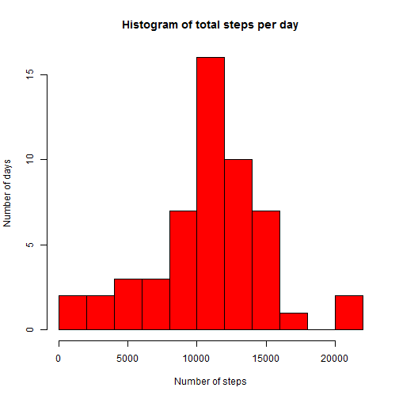
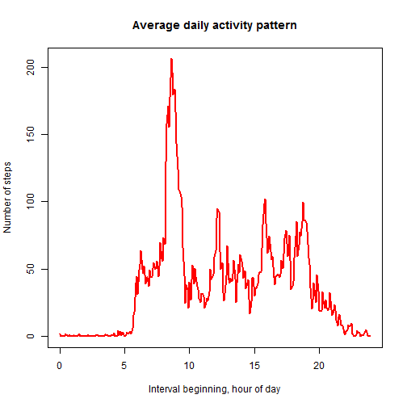
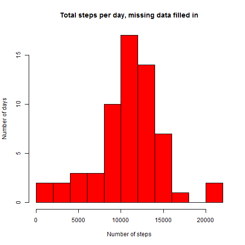
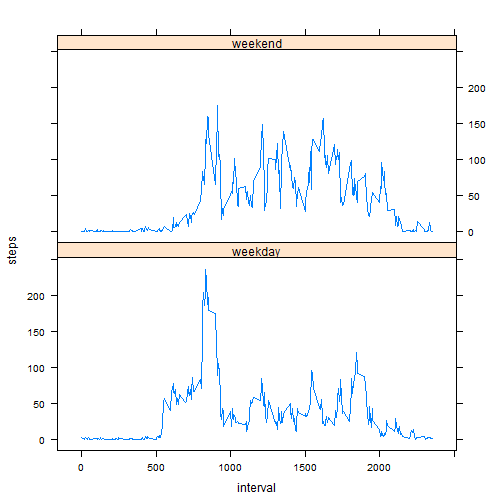

#Report on steps taken by some individual somewhere in this world.


```r
Sys.setlocale("LC_ALL","English") #The report is in English
```


```r
fname<-'activity.csv'
fnamezip<-'activity.zip'

if (file.exists(fname)){
   dat<-read.csv(fname)
}else if (file.exists(fnamezip)){
      unzip(fnamezip)
      dat<-read.csv(fname)
  } else (stop('files are missing'))
```

##Histogram of number of steps per day   

Days containing missing values are discarded.


```r
daysum<-tapply(dat$steps,dat$date,sum)
hist(daysum,breaks=10,col='red',
     main='Histogram of total steps per day',
     xlab='Number of steps',ylab='Number of days')
```




```r
meanval<-mean(daysum,na.rm=TRUE)
medianval<-median(daysum,na.rm=TRUE)
```
The mean value of steps taken per day is 10766.189.   
The median value of steps taken per day is 10765.

##Daily pattern

```r
hourofday<-24*(0:287)/288
daypat<-tapply(dat$steps,dat$interval,mean,na.rm=TRUE)
plot(hourofday,daypat,type='l',col='red',lwd=2,
     xlab='Interval beginning, hour of day',
     ylab='Number of steps',
     main='Average daily activity pattern')
```



```r
maxsteps<-max(daypat,na.rm=TRUE)
maxstepsint<-names(daypat)[which.max(daypat)]
maxhour=floor(as.numeric(maxstepsint)/100)
maxminute=as.numeric(maxstepsint)-100*maxhour
```
Maximum number of steps (206.17) is taken on average in the time interval starting at
08 hours 35 minutes.

##Imputing missing values
I replace each missing value occuring on time interval T (like 1635 or 015) on some day of the week 'D' (like Sunday or Wednesday) with the average value of steps taken during the time interval T on all 'D' days of the week across the dataset.The total number of missing values is 
2304.


```r
daynames<-weekdays(as.Date(dat$date))
meanstepsdaytime<-tapply(dat$steps,interaction(daynames,dat$interval),
                         mean,na.rm=TRUE)
datn<-dat
means<-meanstepsdaytime[interaction(daynames,datn$interval)]
datn$steps[is.na(datn$steps)]<-means[is.na(datn$steps)]
```
After imputing missing values the histogram looks like this.


```r
daysumn<-tapply(datn$steps,datn$date,sum)
hist(daysumn,breaks=10,col='red',
     main='Total steps per day, missing data filled in',
     xlab='Number of steps',ylab='Number of days')
```



```r
meanvaln<-mean(daysumn)
medianvaln<-median(daysumn)
```
The mean value of steps taken per day after imputing missing data is 10821.210 (without imputing 10766.189).   
The median value of steps taken per day is 11015.000 (without imputing 10765). As one can see, the described strategy of filling in the missing data led to increase in both mean and median of the number of steps per day. The difference between the mean and the median became more pronounced.

##Difference between weekdays and weekends


```r
daytype<-vector(mode='character',length=length(datn$steps))
daytype[1:length(daytype)]<-'weekday';
daytype[daynames=='Saturday' | daynames=='Sunday']<-'weekend'
datn$daytype<-as.factor(daytype)
timetypestat<-aggregate(datn$steps,by=list(datn$interval,datn$daytype),mean)
library(lattice)
names(timetypestat)<-c('interval','daytype','steps')
xyplot(steps~interval|daytype,data=timetypestat,type='l',layout=c(1,2))
```


